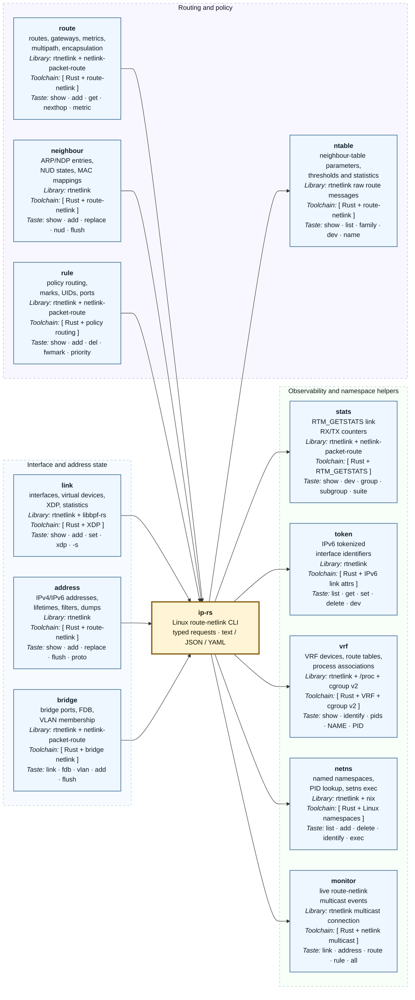

# `ip-rs` overview

`ip-rs` is a Linux-focused Rust implementation of the most useful parts of
the `ip` command. The diagram below shows the implemented command families,
their functional scope, the primary library or kernel interface behind each
one, and a small sample of the available syntax.

This is an overview rather than an exhaustive grammar. For detailed coverage,
limitations, and deferred command families, see
[`IMPLEMENTATION_STATUS.md`](IMPLEMENTATION_STATUS.md).

## Global options shared by the command families

These are applied at the `ip-rs` level and are intentionally not repeated in
every command box:

| Option | Purpose |
| --- | --- |
| `-j` / `--json` | Structured JSON output. |
| `-y` / `--yaml` | Structured YAML output. |
| `-d` | More interface or route details. |
| `-s` / `--stats` | Statistics where the selected command supports them. |
| `-4`, `-6`, `-B`, `-0` | Select IPv4, IPv6, bridge, or link-layer families. |
| `-o` / `--oneline` | Keep each displayed record on one line. |
| `-b` / `--brief` | Use brief output; `-br` is accepted as an alias. |
| `-n` / `--netns` | Execute the request in a named, PID, or path-selected network namespace. |

The diagram covers implemented command families; specialized families such as
`ip nexthop`, `ip xfrm`, `ip mptcp`, full `ip tc`, `ip mroute`, and `ip vrf
exec` remain documented as deferred in the implementation status file.
